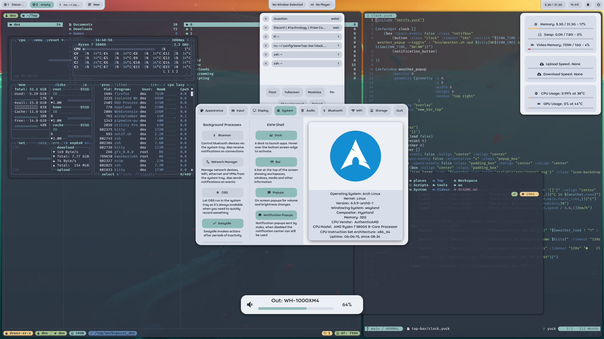
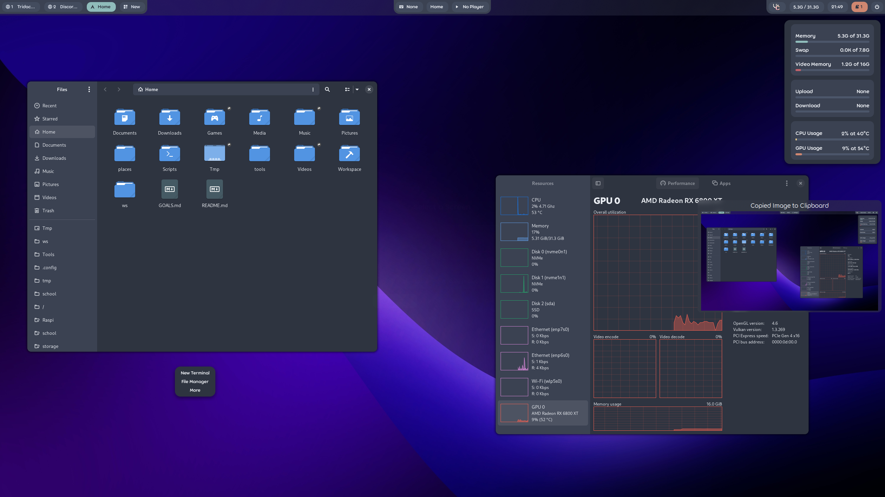

# Dotfiles

These are my configurations for a bunch of programs:
- [Hyprland](https://github.com/hyprwm/Hyprland)
- My own shell based on [EWW](https://github.com/elkowar/eww)
- Rofi

### Light theme:

### Dark theme:

